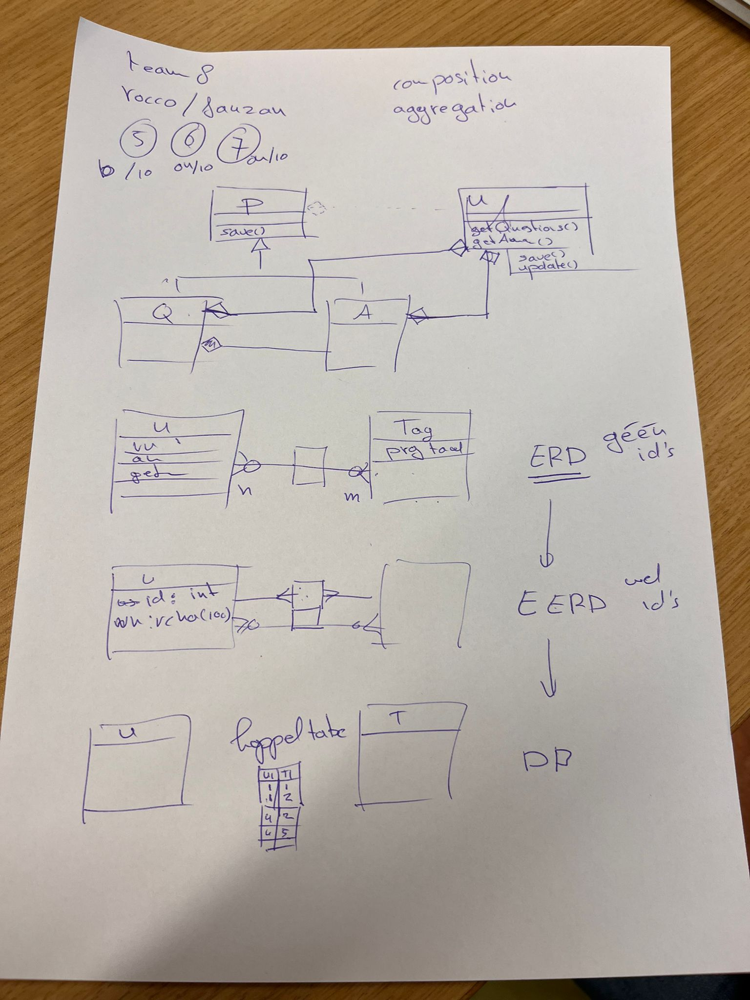

# Expertreview sprint 2 blok 2

We hebben tijdens de expert review naar de volgende kwaliteitscriteria gekeken: K5 (OOP), K6 (ERD/Databse), K7 (UML).

We begonnen met de uitleg over onze UML. Hierbij werd uitgelegd wat onze classes zijn en welke relatie ze met elkaar hadden. Wat bleek is dat wij vergeten waren om de class user een relatie te geven met de answer class en we waren ook een paar methodes vergeten toe te voegen aan sommige classes om aan te duiden dat ze een compositie relatie hebben.

Vervolgens keken we naar onze ERD. Hierbij hadden we uitgelegd over de relaties van onze tabellen uit onze Database. Hieruit bleek dat we een EERD hadden gemaakt in plaats van een ERD (dit kwam omdat wij ID's en een koppeltabel hadden in onze diagram). We vergaten om een relatie te leggen tussen user met answer, waardoor het leek dat een user geen answer kon maken en we hadden onze koppeltabel niet gekoppeld met de user tabel (UserTags) en question tabel (QuestionTags).

Tot slot keken we naar beide onze codes om te kijken of OOP van toepassing was op onze code. Hierbij werd Fauzan gevraagd waarom hij bij de methode retrieveQueston() als promise een string met square brackets had gebruikt, terwijl er maar 1 question terug zal komen. De reden voor was, omdat we niet bepaald keuze hadden, want de api geeft standaard een array terug uit de database ondanks de feit dat onze query alleen maar 1 vraag terug wilt krijgen. Fauzan kreeg de feedback om met de code te spelen, zodat hij het beter begreep.

---

---
foto van de feedback van Nico