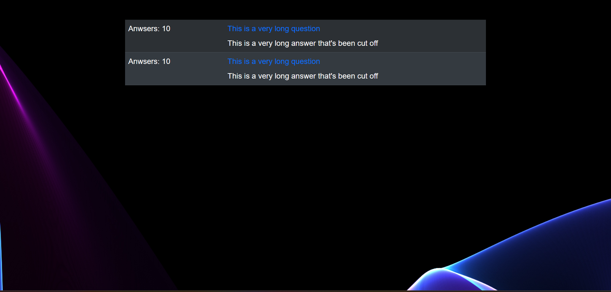

# Productreview sprint 1

### AANTONINGEN
We waren begonnen met het laten zien van onze issue board, waarop te zien was dat wij 1 stories hadden afgerond, 3 op verify stonden (dus ze moeten nog beoordeeld worden door Fauzan of Rocco), 3 op doing en 3 op open stonden. 

Vervolgens lieten we de mindmap zien. Hierbij legde wij uit hoe wij onze mindmap hadden verdeeld. Het is zo ingedeeld dat de rechter kant van de mindmap specifiek voor de developers zijn en de linker kant van de mindmap specifiek voor de klant was.

De mindmap op dit moment is vertakt in de volgende categorieën:

**App architecture** die de focus heeft op hoe de frontend en database ingericht zijn.

**Development methode** die de focus heeft op hoe wij als duo te werk gaan aan deze project (in dit geval door middel van een gitlab project, code reviews, documentaties en de SCRUM methodiek).

**Target** die de focus heeft op wie wij onze webapplicatie richten, wij focussen hierbij op voornamelijk de volgende groepen: programmeurs, technische enthousiasten, Studenten/leerlingen, professionals/experts, technische gemeenschap en probleem oplossers.

**Features** die de focus legt op wat onze applicatie aanbiedt. Wij bieden momenteel een platform aan waarop je code vragen kan stellen, waarop je oplossingen kan vinden voor je code problemen en code vragen kan beantwoorden die door andere gebruikers van dit platform zijn gesteld.

**Benefits** die de focus heeft van wat de voordelen zijn voor het gebruiken van onze web applicatie. Wij zullen de volgende voordelen aanbieden bij het gebruiken van onze app: Je kan met onze app gemeenschappen bouwen met gebruikers die ook jou nieuwsgierigheid en interesses delen, Je kan met onze app je programmeer vaardigheden verbeteren en je kan als je wat meer ervaring hebt als programmeur jou kennis delen met anderen.

---

#### foto van de mindmap die hier boven werd vermeld.
---

We hebben vervolgens laten zien hoe ver we waren waren door middel van een korte demo van onze MVP, Hierbij was te zien hoe je een nieuwe vraag kan aanmaken en dat wanneer je klaar bent met het schrijven van je vraag het ook meteen kon zien in een dashboard met andere vragen die door andere gebruikers waren gesteld.

---

#### foto van de MVP in sprint 1.
---

### FEEDBACK
Wij hadden de volgende tips en tops als feedback ontvangen.

#### TIPS : 
- gebruik maken van een wireframe voordat we onze website gaan bouwen

#### TOPS :
- Goed gebruik gemaakt van de sprint bord.
- Een uitgebreide mindmap waar in staat hoe onze webapplicatie eruit zal zien en voor welke doelgroepen het zijn.
- Goed nagedacht over hoe de database eruit zal zien met de hulp van een UML diagram.
- Login en registratie werkt.
- De MVP is al te zien door middel van de vragen formulier
- Al een goede idee voor het filteren van de goede vragen en antwoorden van de slechte.
- Goed gewerkt met de branches 

### SLOT
Wat gaan wij volgende sprint met onze feedback doen? We zullen de tip om een wireframe te gebruiken voordat wij gaan bouwen aan onze web applicatie. Voor de rest zullen wij de MVP verder uitwerken.

