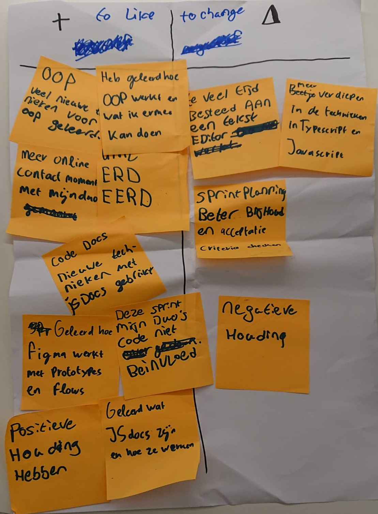

# Retrospective Sprint 2 CodeExchange

## inleiding
hieronder bevindt de documentatie van retrospective 2. De documentatie is verdeeld in de volgende kopjes: een "To Like" kopje waarin al onze  positieve dingen van sprint 2 genoteerd staan, een "To Change" kopje waarin al onze veranderingspunten voor sprint 2, een terugblik kopje waarin een korte samenvatting staat van onze actiepunten van vorige sprint en hoe wij die in sprint 2 hadden waar gemaakt en tot slot een conclusie kopje, waarin onze actiepunten staan voor de volgende sprint.

## To Like (Waar zijn wij tevreden over?)
- Wij zijn zeer tevreden over hoe onze contactmomenten zijn verlopen voor onze project, zowel fysiek en online.
- Wij zijn tevreden over hoe wij leerden wat JSDocs zijn en hoe wij dat konden gebruiken voor de documentatie van onze code.
- Wij zijn tevreden over hoe wij Figma hadden gebruikt om onze prototypes te maken en die leven te geven door middel van flows.
- Wij zijn blij met onze voortgang op het gebied van feedback geven op elkaars code (Vorige sprint werd de code volledig veranderd door de feedbackgever, waardoor de feedbackontvanger er niets van had geleerd).
- Wij zijn tevreden over onze positieve houding die wij beide hadden in deze sprint.

## To Change (Waar moeten er veranderingen komen?)
- Wij vinden dat er een verandering moet plaatsvinden aan de het aantal tijd die wij hadden besteed aan onze code editor. We kwamen hierdoor bijna in tijdsnood.
- Wij vinden dat wij meer moeten verdiepen op de verschillende technieken die van toepassing zijn in JavaScript en TypeScript.
- Wij vinden dat wij ervoor moeten zorgen dat wij wat beter onze sprint planning bijhouden en hierbij ook rekening moeten houden met de accepatie criteria die bij elke user story hoort.
- Wij vinden dat we elkaars houding moeten checken, zodat wij beide als duo met een positief gevoel aan ons project kunnen werken.

---

#### foto van onze retrospective die wij hadden gemaakt voor sprint 2
---

## Terugblik actiepunten sprint 1
Wij hebben vorige sprint de volgende actiepunten opgeschreven :
- Hoe kunnen wij ervoor zorgen dat wij de MVP af hebben voor het eind van sprint 2? We kunnen dit doel bereiken door middel van het afmaken van de user stories die te maken hebben met het plaatsen van vragen, antwoorden en het opslaan van beide.
- Hoe kunnen wij ervoor zorgen dat we steeds meer contact hebben met elkaar online? We kunnen dit doel gemakkelijk bereiken door ervoor te zorgen dat wanneer 1 van ons aan het werk is aan de Code Exchange project, dat die ene persoon in de voice chat zit van onze privé server.
- Hoe kunnen wij ervoor zorgen dat we meer rekening zullen houden met het verschil in programmeer kennis in onze duo? We kunnen dit behalen door middel van meer comments die uitleggen wat elke functie doet en waarom we bijvoorbeeld een for loop gebruiken en dat tijdens het feedback geven van onze code een suggestie schrijven in de vorm van code in plaats van dat degene die de code reviewt zelf de code als het ware fixt.

We hebben deze sprint al onze doelen/actiepunten die wij vorige sprint hadden gezet behaald.

- De MVP was af en dat was terug te zien in onze product review, je kon vragen stellen en daarop een tag plaatsen voor de expertise, Je kon op de vragen antwoorden en iedere vraag had een aparte pagina met aparate antwoorden.
- We hebben de volgende afspraak met elkaar gemaakt. Wanneer je aan school zit dan ga je in de Spraak kanaal. Hierdoor kunnen wij als duo zien wanneer 1 van ons aan het project zit te werken.
- We hebben nu ervoor gezorgd dat er feedback wordt gegeven door middel van suggesties in plaats van dat de code wordt hergeschreven door de feedbackgever.

## conclusie
Wij zullen de volgenden sprint de volgende actiepunten ondernemen :
- Wij zullen ieder elke dag een beetje meer verdiepen op de programmeer technieken van TypeScript en JavaScript (als het nodig is voor die persoon), door middel van bijvoorbeeld TypeHero.
- Wij zullen onze sprintplanning verbeteren door de kwaliteits criteria per userstory in de gaten te houden en vanuit daar een wat meer accurate weight toevoegen (weight als in hoelang een userstory zal duren).
- Wij zullen ervoor zorgen dat we beide gemotiveerd blijven, zodat we beide progressie zullen zien in onze programmeer vaardigheden en CodeExchange project. 

